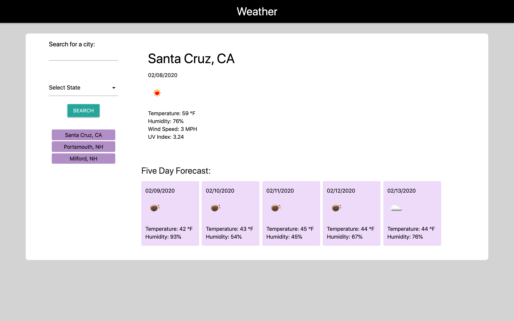

# weather_app
UNH Bootcamp Week 6 HW

 

Link to live website: (https://sldelay.github.io/weather_app/)

## Instructions

Your challenge is to build a weather dashboard that will run in the browser and feature dynamically updated HTML and CSS.

Use the [OpenWeather API](https://openweathermap.org/api) to retrieve weather data for cities. Use `localStorage` to store any persistent data.

## Project Info.

### Languages Used:
HTML, CSS, JavaScript, jQuery

### Other Tools:
Materialize CSS, Moment.js, OpenWeather API, OpenCageData API

### How It Works:
When a user loads up the application, they will see an input where they can search for any city in the United States. All of the users searches will be displayed on the screen underneath the submit button. The weather dashboard will display the current weather as well as a five day forecast. When the page is reloaded, the weather for the most recent city will be displayed.
